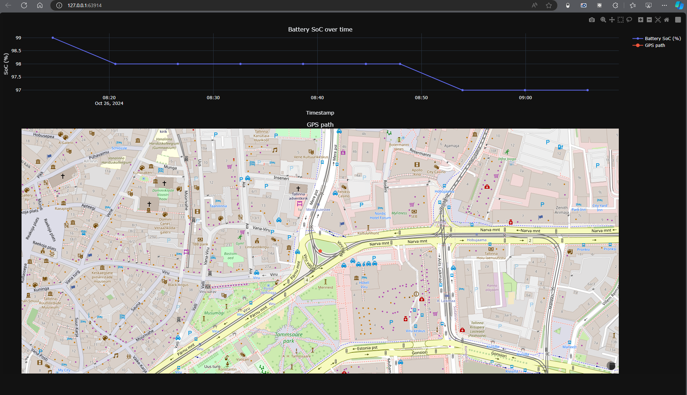

# 1-ESP32 T-SIM7600E-H GPS TRACKER

This repo contains an ESP32 PlatformIO project utilizing LILYGO ESP32 module T-SIM7600E-H as a GPS Tracker with thingspeak client

## 1.1-Modifications that requires attention
### 1.1.1-Code
- create secrets.h
- add gsm pin code if there is any
- add thingspeak API key

```
/* Define to prevent recursive inclusion */
#ifndef SECRETS_H
#define SECRETS_H

// GSM PIN, if any
#define GSM_PIN  "<GSM pin code if any>"

// Thingspeak API key
const char *API_KEY = "<thingspeak API key>";

#endif /* SECRETS_H */
```

- make sure you have the correct provider apn and server if you are using 
- in [main source file](src/main.cpp)
- update the apn according to your sim card provider (usually this information can be found through the provider website)

### 1.1.2-PlatformIO configuration
- in [PlatformIO config file](platformio.ini)
- update upload and monitor ports, usually the same port if you are using the TTL USB C hub in LILYGO T-SIM7600E-H
```
upload_port = <upload port number>
monitor_port = <monitor port number>
```

## 1.2 N.B.
- please make sure that your sim card have internet access

## conclusion
thingspeak request
```
https://api.thingspeak.com/channels/{channel_id}/feeds.json?api_key={api_key}&results={results_length}\\
```
graphically with python, plotly lib (please note that the data are generic for demo purposes)

